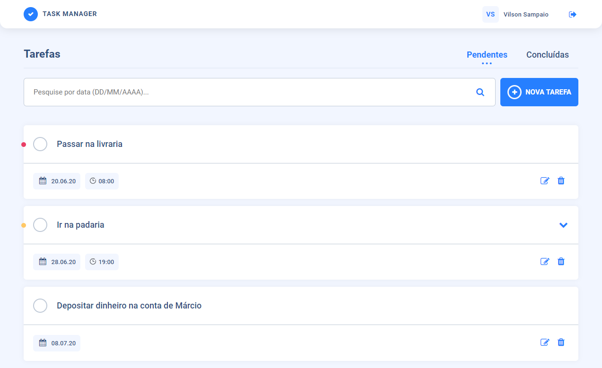
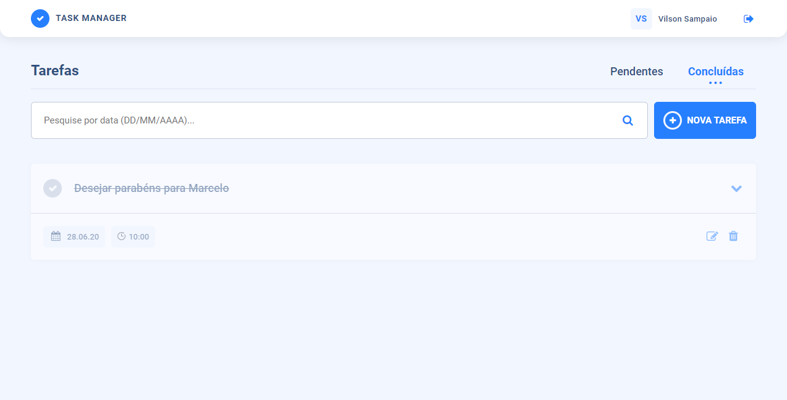
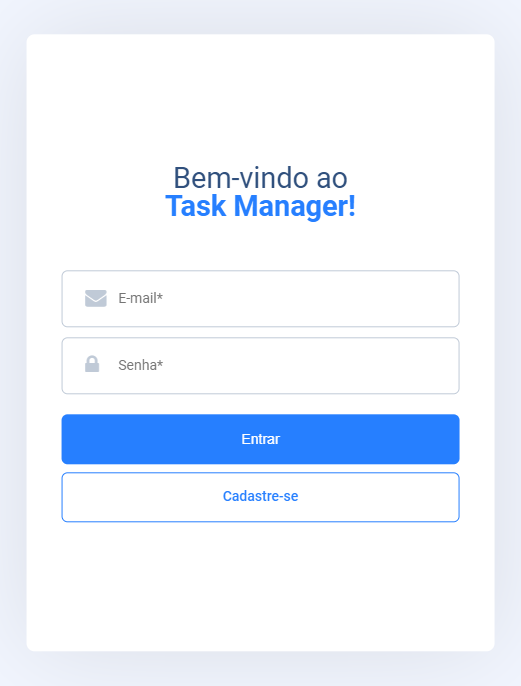
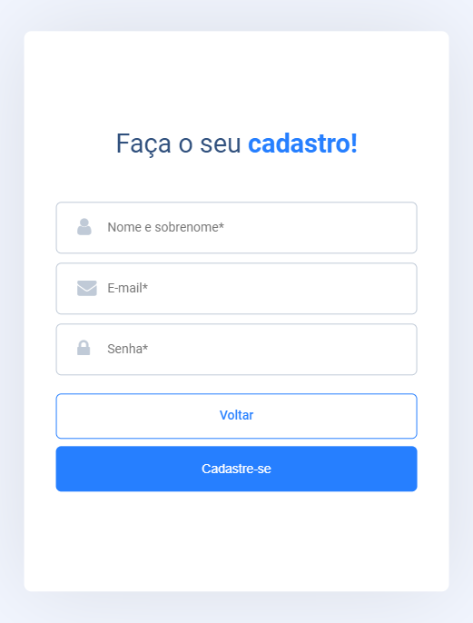
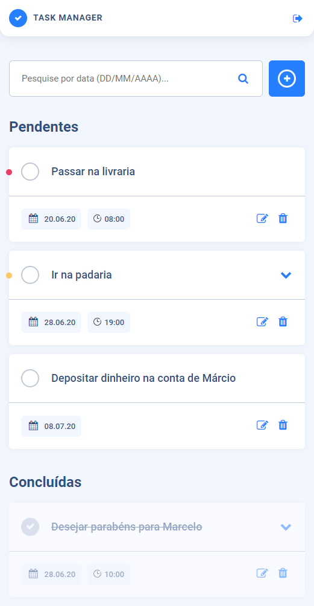

<h1 align="center">
    
</h1>

  
   
  

  

  

  <a href="#-sobre-o-projeto">Sobre o projeto</a>&nbsp;&nbsp;&nbsp;|&nbsp;&nbsp;&nbsp;
  <a href="#-tecnologias">Tecnologias</a>&nbsp;&nbsp;&nbsp;|&nbsp;&nbsp;&nbsp;
  <a href="#-layout">Layout</a>&nbsp;&nbsp;&nbsp;|&nbsp;&nbsp;&nbsp;
  <a href="#-projeto-final">Projeto final</a>

 

  

## 💻 Sobre o projeto

O Task Manager é um sistema para gerenciar de tarefas, conectado a um banco de dados, onde é possível adicionar, editar e excluir tarefas, além de marcá-las como concluídas.

## 🚀 Tecnologias

Esse projeto foi desenvolvido com as seguintes tecnologias:

- [PHP](https://www.php.net/manual/pt_BR/intro-whatis.php)
- [JavaScript](https://www.javascript.com/)
- [MySQL](https://www.mysql.com/)

## 🔖 Layout

O layout do sistema é responsivo e foi inspirado em um shot do Dribble. Você pode conferir através [desse link](https://dribbble.com/shots/10943578-Task-Manager).

## 🌐 Projeto final

### 🖥 Desktop
#### Página de login

#### Página de cadastro

#### Dashboard

 

### 📱 Mobile
#### Página de login

#### Página de cadastro

#### Dashboard

---

Feito com 💙 <a href="https://www.linkedin.com/in/vilsonsampaio/">Vilson Sampaio</a>

